## -
title: "Análisis Descriptivo de la Base de Datos DVDRENTAL"
author: "Karen Morales"
date: "`r Sys.Date()`"
output:
  pdf_document: default
  word_document: default
## -

# 🎬 Introducción

El presente análisis se realizó utilizando la base de datos **dvdrental**, cargada en PostgreSQL a través de un contenedor Docker.  
El objetivo es aplicar consultas descriptivas para obtener métricas sobre clientes, películas, rentas e ingresos.  
Las consultas se ejecutaron desde **DBeaver**, utilizando el motor de PostgreSQL.

## -

# 🧩 Consultas y Resultados

##  1. Total de clientes activos
```sql
SELECT COUNT(*) AS total_clientes_activos
FROM customer
WHERE active = 1;
```
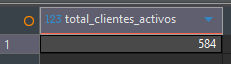

## Número de clientes por ciudad
```sql
SELECT ci.city, COUNT(c.customer_id) AS total_clientes
FROM customer c
JOIN address a ON c.address_id = a.address_id
JOIN city ci ON a.city_id = ci.city_id
GROUP BY ci.city
ORDER BY total_clientes DESC;
```
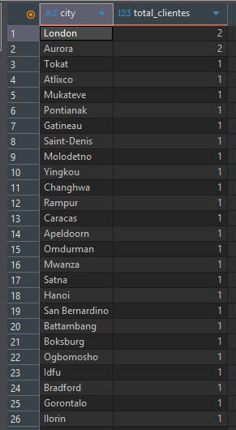

## Promedio de clientes por país
```sql
SELECT co.country, COUNT(c.customer_id) AS total_clientes,
       ROUND(AVG(COUNT(c.customer_id)) OVER(), 2) AS promedio_general
FROM customer c
JOIN address a ON c.address_id = a.address_id
JOIN city ci ON a.city_id = ci.city_id
JOIN country co ON ci.country_id = co.country_id
GROUP BY co.country;
```
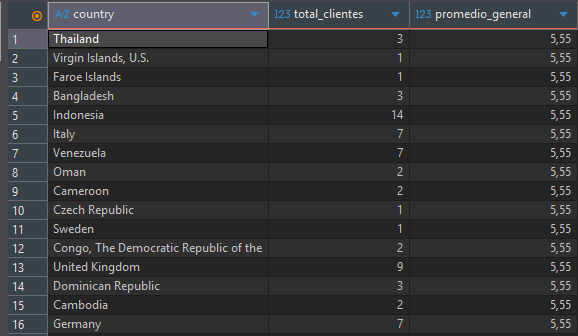

## Clientes con más rentas realizadas
```sql
SELECT c.first_name || ' ' || c.last_name AS cliente,
       COUNT(r.rental_id) AS total_rentas
FROM rental r
JOIN customer c ON r.customer_id = c.customer_id
GROUP BY cliente
ORDER BY total_rentas DESC
LIMIT 10;
```
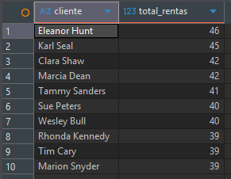

## Total de películas disponibles en inventario
```sql
SELECT COUNT(*) AS total_peliculas FROM inventory;
```
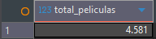

## Cantidad de películas por categoría
```sql
SELECT cat.name AS categoria, COUNT(f.film_id) AS cantidad
FROM film f
JOIN film_category fc ON f.film_id = fc.film_id
JOIN category cat ON fc.category_id = cat.category_id
GROUP BY cat.name
ORDER BY cantidad DESC;
```
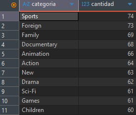

## Duración promedio de películas por categoría
```sql
SELECT cat.name AS categoria, ROUND(AVG(f.length),2) AS duracion_promedio
FROM film f
JOIN film_category fc ON f.film_id = fc.film_id
JOIN category cat ON fc.category_id = cat.category_id
GROUP BY cat.name
ORDER BY duracion_promedio DESC;
```
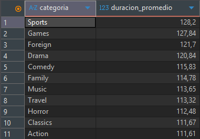

## Clasificación más común de las películas
```sql
SELECT rating, COUNT(*) AS cantidad
FROM film
GROUP BY rating
ORDER BY cantidad DESC
LIMIT 1;
```
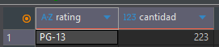

## Cantidad total de copias en inventario
```sql
SELECT COUNT(inventory_id) AS total_copias FROM inventory;
```
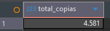

## Películas más rentadas
```sql
SELECT f.title, COUNT(r.rental_id) AS total_rentas
FROM rental r
JOIN inventory i ON r.inventory_id = i.inventory_id
JOIN film f ON i.film_id = f.film_id
GROUP BY f.title
ORDER BY total_rentas DESC
LIMIT 10;
```
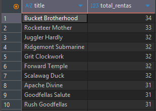

## Promedio de días de alquiler por película
```sql
SELECT f.title, AVG(r.return_date - r.rental_date) AS promedio_dias
FROM rental r
JOIN inventory i ON r.inventory_id = i.inventory_id
JOIN film f ON i.film_id = f.film_id
WHERE r.return_date IS NOT NULL
GROUP BY f.title
ORDER BY promedio_dias DESC;
```
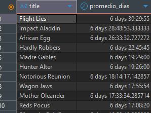

## Rentas por mes y año
```sql
SELECT DATE_PART('year', rental_date) AS año,
       DATE_PART('month', rental_date) AS mes,
       COUNT(*) AS total_rentas
FROM rental
GROUP BY año, mes
ORDER BY año, mes;
```
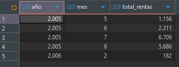

## Total de ingresos generados
```sql
SELECT SUM(amount) AS total_ingresos FROM payment;
```
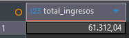

## Ingreso total por cada cliente
```sql
SELECT c.first_name || ' ' || c.last_name AS cliente, SUM(p.amount) AS total_ingreso
FROM payment p
JOIN customer c ON p.customer_id = c.customer_id
GROUP BY cliente
ORDER BY total_ingreso DESC;
```
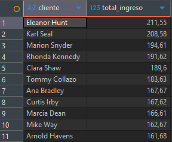

## Ingreso promedio por tienda
```sql
SELECT s.store_id, ROUND(AVG(p.amount),2) AS ingreso_promedio
FROM payment p
JOIN staff st ON p.staff_id = st.staff_id
JOIN store s ON st.store_id = s.store_id
GROUP BY s.store_id;
```
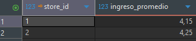

## Total de empleados por tienda
```sql
SELECT store_id, COUNT(*) AS total_empleados
FROM staff
GROUP BY store_id;
```
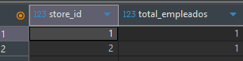

## Empleado con más pagos procesados
```sql
SELECT s.first_name || ' ' || s.last_name AS empleado, COUNT(p.payment_id) AS pagos
FROM payment p
JOIN staff s ON p.staff_id = s.staff_id
GROUP BY empleado
ORDER BY pagos DESC
LIMIT 1;
```
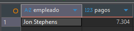

## Promedio de monto por transacción procesada por empleado
```sql
SELECT s.first_name || ' ' || s.last_name AS empleado, ROUND(AVG(p.amount),2) AS promedio_monto
FROM payment p
JOIN staff s ON p.staff_id = s.staff_id
GROUP BY empleado;
```
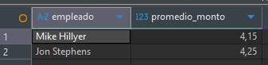

## Días con mayor cantidad de rentas
```sql
SELECT rental_date::date AS fecha, COUNT(*) AS total_rentas
FROM rental
GROUP BY fecha
ORDER BY total_rentas DESC
LIMIT 10;
```
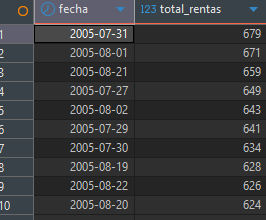

## Correlación entre duración y costo de renta de las películas
```sql
SELECT CORR(length, rental_rate) AS correlacion
FROM film;
```
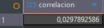

## Clasifica a los clientes según su gasto total
```sql
SELECT c.customer_id, c.first_name, c.last_name,
       SUM(p.amount) AS total_gasto,
       CASE
           WHEN SUM(p.amount) > 150 THEN 'Premium'
           WHEN SUM(p.amount) BETWEEN 100 AND 150 THEN 'Frecuente'
           ELSE 'Ocasional'
       END AS categoria_cliente
FROM payment p
JOIN customer c ON p.customer_id = c.customer_id
GROUP BY c.customer_id, c.first_name, c.last_name;
```
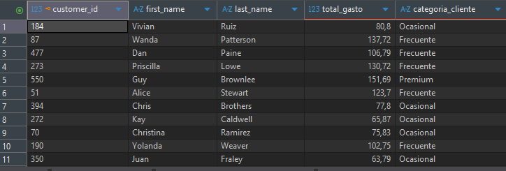

## Combina cantidad de rentas y promedio de duración de alquiler
```sql
SELECT 
    f.title AS pelicula,
    COUNT(r.rental_id) AS total_rentas,
    AVG(r.return_date - r.rental_date) AS promedio_dias_alquiler
FROM rental r
JOIN inventory i ON r.inventory_id = i.inventory_id
JOIN film f ON i.film_id = f.film_id
WHERE r.return_date IS NOT NULL
GROUP BY f.title
ORDER BY total_rentas DESC, promedio_dias_alquiler DESC;
```
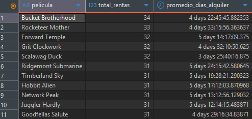

## Calcula ingresos mensuales por tienda y los clasifica en ranking
```sql
SELECT 
    s.store_id,
    DATE_TRUNC('month', p.payment_date) AS mes,
    SUM(p.amount) AS ingresos_mensuales,
    RANK() OVER (PARTITION BY DATE_TRUNC('month', p.payment_date)
                 ORDER BY SUM(p.amount) DESC) AS ranking_tienda
FROM payment p
JOIN staff st ON p.staff_id = st.staff_id
JOIN store s ON st.store_id = s.store_id
GROUP BY s.store_id, DATE_TRUNC('month', p.payment_date)
ORDER BY mes, ranking_tienda;
```
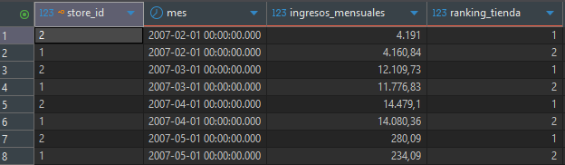

## Determina qué actores han participado más y en qué tipo de películas
```sql
SELECT 
    a.first_name || ' ' || a.last_name AS actor,
    cat.name AS categoria,
    COUNT(f.film_id) AS total_peliculas
FROM film_actor fa
JOIN actor a ON fa.actor_id = a.actor_id
JOIN film f ON fa.film_id = f.film_id
JOIN film_category fc ON f.film_id = fc.film_id
JOIN category cat ON fc.category_id = cat.category_id
GROUP BY actor, cat.name
ORDER BY total_peliculas DESC
LIMIT 20;
```
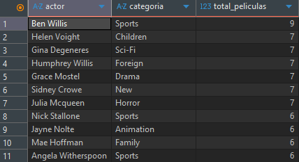

## Detecta clientes que suelen devolver películas tarde
```sql
SELECT 
    c.customer_id,
    c.first_name || ' ' || c.last_name AS cliente,
    ROUND(AVG(EXTRACT(DAY FROM (r.return_date - r.rental_date))), 2) AS promedio_dias_alquiler,
    CASE
        WHEN ROUND(AVG(EXTRACT(DAY FROM (r.return_date - r.rental_date))), 2) > 5 THEN 'Suele devolver tarde'
        ELSE 'Devuelve a tiempo'
    END AS comportamiento
FROM rental r
JOIN customer c ON r.customer_id = c.customer_id
WHERE r.return_date IS NOT NULL
GROUP BY c.customer_id, c.first_name, c.last_name
ORDER BY promedio_dias_alquiler DESC;
```
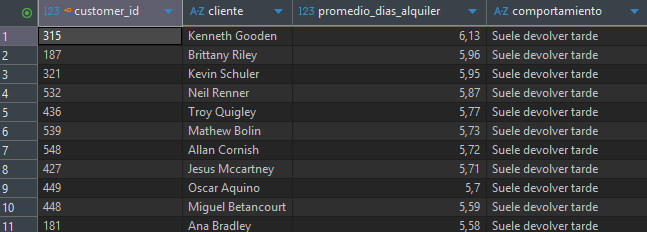


